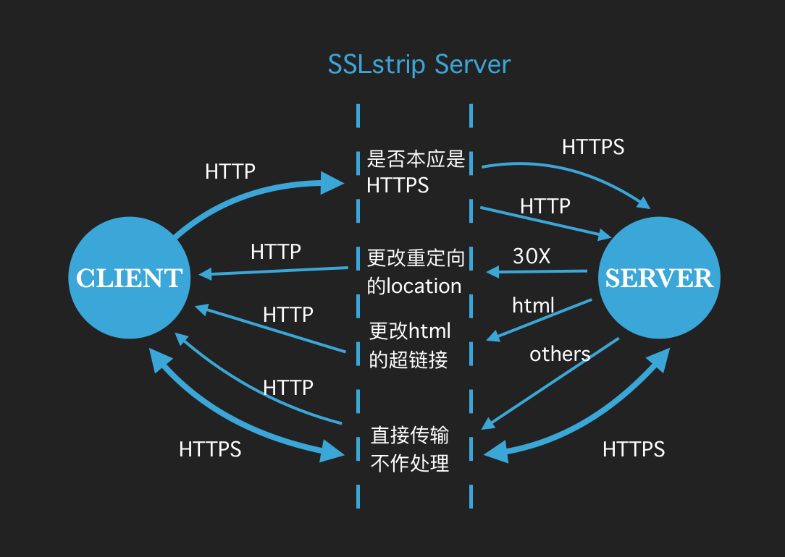

### 使用方式
下载代码后，运行

``` javascript
node index.js
```
程序默认会监听 8081 端口，此时通过中间人攻击或者设置 http 代理，把流量导入到该程序，程序会实现 SSLstrip 功能并把重要请求（本应是 https 的请求）的内容打印到控制台上。

### SSLstrip 介绍
SSLstrip 也叫 https 降级攻击，攻击者拦截用户流量后，欺骗用户与攻击者进行 http 通信，攻击者与服务器保持正常通信 （http 或 https），从而获取用户信息。攻击原理如下：

1. 监听 http 流量
2. 更改重定向链接中的 location，替换 https 为 http，并记录
3. 更改响应内容中的超链接，替换 https 为 http，并记录
4. 与用户进行 http 通信，与服务器进行 https 通信（记录中本应是 https 的请求），从而明文获取用户信息

原理示意图如下：


